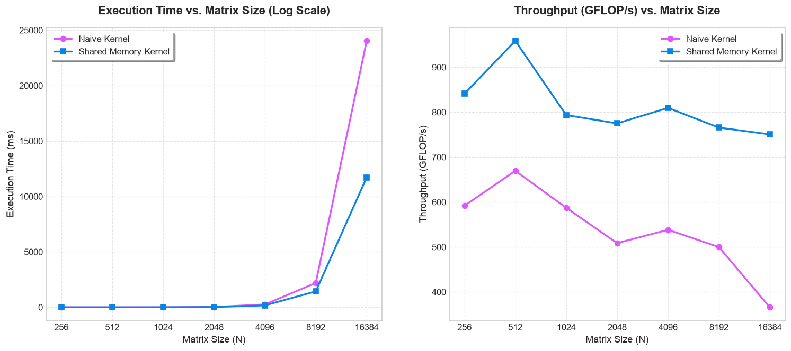

# Breeze 🌬️

Breeze is a header-only tensor (toy) library built with C++20 and CUDA. 
It provides a simple `Tensor` representation, smart RAII-based device memory management, common element-wise operations, and optimized matrix multiplication implementations. *(for now)*

## Usage

The easiest way to build the project is using the **Nix** package manager, which guarantees consistent versions of the CUDA toolkit, compilers, and libraries.

### Instructions to build and test demos
Once inside the development shell, run the following commands to configure and compile the project targets:

```bash
cmake -B build -S .
cmake --build build
```

## Benchmark

A basic matrix multiplication benchmark. More stuff to be added soon.

<details><summary>Matrix Multiplication Benchmark</summary>
This was benchmarked on an RTX 3060 Mobile with 6GB VRAM. Currently, cold starts are unaccounted for.

</details>

